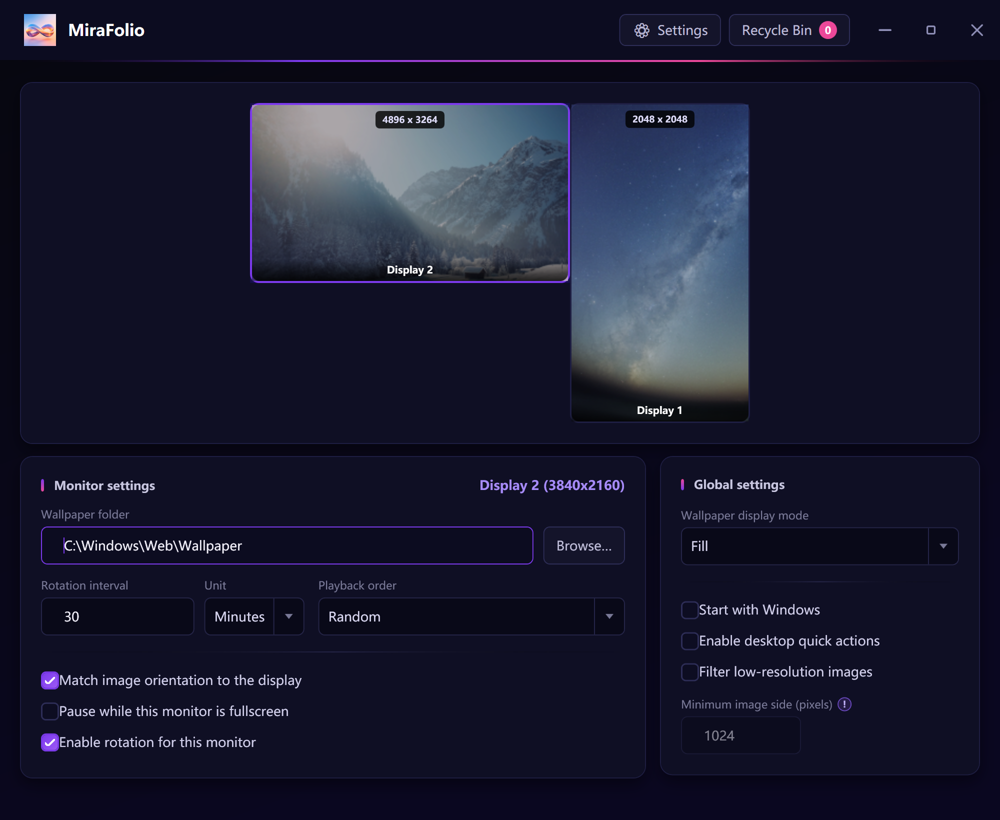

# MiraFolio Windows 版

  

  <strong>让每一台显示器都有自己的壁纸节奏。</strong>

  专为 Windows 多显示器和海量本地图库打造的壁纸轮替工具。

  

  <a href="README.md">English</a> ·
  简体中文 ·
  <a href="README.zh-TW.md">繁體中文</a> ·
  <a href="README.de.md">Deutsch</a> ·
  <a href="README.fr.md">Français</a> ·
  <a href="README.es.md">Español</a> ·
  <a href="README.ja.md">日本語</a> ·
  <a href="README.ko.md">한국어</a> ·
  <a href="README.ru.md">Русский</a>

  <a href="https://www.mirafolio.app/zh-cn/?utm_source=github&utm_medium=readme&utm_campaign=windows_mobile_cross_promo&utm_content=zh_cn_top_website">官方网站</a> ·
  <a href="docs/privacy.md">隐私说明</a> ·
  <a href="https://github.com/nexalify/MiraFolio-Windows/issues">问题反馈</a>

  

> [!NOTE]
> **MiraFolio 1.0.0 已正式发布。** 请从
> [GitHub 官方 Release](https://github.com/nexalify/MiraFolio-Windows/releases/latest)
> 下载 Windows x64 便携版。

## 更适合多显示器的壁纸体验

- **每台显示器独立设置。** 分别选择图片文件夹、轮替间隔、播放顺序，并决定是否启用轮替。
- **面向数万张以上的大型图库。** 在后台分批建立图片索引并缓存尺寸信息，后续启动不必重新读取
  每一张图片的尺寸，让海量本地壁纸也能方便地参与轮播。
- **边看边筛，一键淘汰。** 遇到不喜欢的壁纸可以立即移出后续轮播，但不会删除原文件；之后还能
  从回收站恢复。
- **显示器变化互不影响。** 少接一台显示器不会隐藏或中断其他屏幕；Windows 识别到新显示器后，
  也可以立即为它配置壁纸。
- **更聪明地选择图片。** 横图匹配横屏、竖图匹配竖屏，还可以自动跳过尺寸过小的图片。
- **隐私优先。** 无需账号、云服务或联网同步，不包含分析统计，也不会上传壁纸。

## 你可以用它做什么

- 支持无重复随机、正序和倒序轮替。
- 游戏、演示或视频进入全屏时，可只暂停对应显示器的壁纸轮替。
- 通过快捷操作立即换图、在文件管理器中定位当前壁纸或一键淘汰不喜欢的图片。
- 在回收站集中查看和恢复已淘汰图片；永久删除必须经过明确确认。
- 支持开机启动，日常操作可以在系统托盘完成。
- 在一个可视化布局中管理横屏、竖屏等混合显示器组合。

## 下载与运行

打开 [MiraFolio 最新 Release](https://github.com/nexalify/MiraFolio-Windows/releases/latest)，展开
**Assets**，下载 `MiraFolio-<version>-win-x64-portable.zip`。当前正式版文件名为
`MiraFolio-1.0.0-win-x64-portable.zip`。将 ZIP 解压到一个固定文件夹，然后运行其中的
`MiraFolio.exe`；无需安装，也无需另外安装 .NET。

## MiraFolio 移动端

如果你也想让喜欢的照片在手机和平板上陪伴你，可以试试 MiraFolio 移动端。选好想看的照片，
接下来的轮换和整理就交给 MiraFolio。

### iPhone 与 iPad

相册里有很多喜欢的照片，却总是只看到那几张？MiraFolio 会先把选中的照片轮完一遍，再重新开始。
遇到不想继续使用的照片，轻轻一滑就能移出轮换；配合 Apple 快捷指令，还可以在每天早上、到家或
充电时自动换一张。私密照片也能放进独立相册并加锁。

[看看 MiraFolio iPhone 与 iPad 版](https://www.mirafolio.app/zh-cn/ios/?utm_source=github&utm_medium=readme&utm_campaign=windows_mobile_cross_promo&utm_content=zh_cn_ios) ·
[前往 App Store 下载](https://apps.apple.com/app/mirafolio-wallpaper-shuffle/id6791570584)

### Android

在 Android 上，你可以先预览效果，再把照片设为主屏、锁屏，或两边一起使用。还可以按自己选择的
间隔自动换图，并从桌面或快捷设置里一键换到下一张，不必每次都打开 App。

[看看 MiraFolio Android 版](https://www.mirafolio.app/zh-cn/android/?utm_source=github&utm_medium=readme&utm_campaign=windows_mobile_cross_promo&utm_content=zh_cn_android) ·
[前往 Google Play 下载](https://play.google.com/store/apps/details?id=com.nexalify.mirafolio)

想看看 MiraFolio 在其他设备上的体验？
[访问 MiraFolio 官网](https://www.mirafolio.app/zh-cn/?utm_source=github&utm_medium=readme&utm_campaign=windows_mobile_cross_promo&utm_content=zh_cn_mobile_website)。

## 快速开始

1. 打开 MiraFolio，在显示器布局中选择一台屏幕。
2. 为这台显示器选择壁纸文件夹。
3. 设置轮替间隔、播放顺序和智能匹配选项。
4. 开启壁纸轮替，之后 MiraFolio 会在系统托盘中持续运行。

如果需要自定义其他显示器，重复前三步即可。

## 系统要求

- Windows 10 或 Windows 11
- x64 PC
- 官方自包含版本无需另外安装 .NET

## 隐私、帮助与项目信息

壁纸、设置、缓存和日志都保留在你的电脑上，详情见 [隐私说明](docs/privacy.md)。Bug 和功能建议可提交到
[GitHub Issues](https://github.com/nexalify/MiraFolio-Windows/issues)，安全问题请按照
[SECURITY.md](SECURITY.md) 中的流程报告。

开发与贡献指南请参阅 [CONTRIBUTING.md](CONTRIBUTING.md)。

MiraFolio 源代码采用 [MIT License](LICENSE)，产品名称、Logo 和图标遵循
[品牌资产政策](TRADEMARKS.md)。
